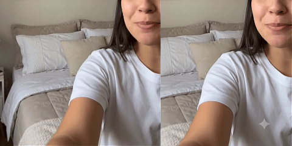

# Gemini / Veo Visible Watermark Remover

A Windows-friendly wrapper around a small `dewatermark.py` CLI for removing the
visible watermark produced by the Gemini OMNI model from videos you have the
right to edit.

## Preview



Tutorial video: [compare.mp4](assets/compare.mp4)

Scope: this project is intended only for the visible Gemini OMNI watermark.
Currently, the drag-and-drop workflow supports only these video sizes:

- `1280x720`
- `720x1280`

## Credits

This project is based on and adapted from
[DevSaraiva/gemini-watermark-remover](https://github.com/DevSaraiva/gemini-watermark-remover).
Thanks to the original author for the core watermark detection/removal workflow
and ProPainter integration.

The drag-and-drop scripts automatically choose the Gemini OMNI sparkle
watermark box from the input video size:

```text
1280x720:  x=1136, y=576,  width=48, height=48
720x1280:  x=576,  y=1136, width=48, height=48
```

The tool removes only the visible overlay. It does not remove invisible
provenance watermarks, SynthID-style signals, or metadata.

## Differences From The Original Project

This version keeps the original CLI idea, but is packaged for easier Windows
drag-and-drop use:

- Added Windows setup scripts for CPU and NVIDIA GPU environments.
- Added drag-and-drop BAT files for CPU, NVIDIA GPU, and preview-only workflows.
- Added fixed small Gemini OMNI watermark boxes for `1280x720` and `720x1280`.
- Added NVIDIA CUDA usage through `--device cuda`.
- Added local `ffmpeg` / `ffprobe` installation through npm packages.
- Added UTF-8 subprocess log handling to avoid Windows console decode crashes.
- Adjusted corner preset behavior to avoid oversized vertical boxes.
- Added a GitHub-ready README, quick-start notes, and publish checklist.

The main practical goal is to make repeated processing faster and simpler for
users who work with the supported Gemini OMNI watermark positions.

## Quick Start

CPU setup:

1. Install Python 3.10-3.12.
2. Install Node.js LTS.
3. Install Git.
4. Double-click `setup_cpu.bat`.
5. Drag videos onto `remove_watermark_cpu_drag.bat`.

NVIDIA GPU setup:

1. Install the NVIDIA driver.
2. Install Python 3.10-3.12.
3. Install Node.js LTS.
4. Install Git.
5. Double-click `setup_gpu_nvidia.bat`.
6. Drag videos onto `remove_watermark_gpu_drag.bat`.

The output is saved next to each input video as:

```text
original_name_clean.mp4
```

## Preview The Box

Drag one video onto:

```text
preview_watermark_box_drag.bat
```

It creates a preview PNG next to the video so you can confirm the red box covers
the watermark.

## Change The Watermark Box

The drag scripts call:

```bat
dewatermark.py input.mp4 --omni-box
```

If you need a custom position, replace `--omni-box` with a manual box:

```text
--box x,y,width,height
```

## Command Line Usage

After setup, you can also run:

```bat
.venv-cpu\Scripts\python.exe dewatermark.py input.mp4 --omni-box -o output.mp4
```

For NVIDIA GPU:

```bat
.venv-gpu\Scripts\python.exe dewatermark.py input.mp4 --omni-box --device cuda -o output.mp4
```

## What Setup Downloads

The setup scripts install local dependencies into this folder:

- `.venv-cpu` or `.venv-gpu`
- `node_modules`
- `ProPainter`
- ProPainter model weights on first inpaint run

These folders are intentionally ignored by Git and should not be committed.

## License

This wrapper keeps the original MIT license. ProPainter is downloaded separately
and is licensed by its own authors.
